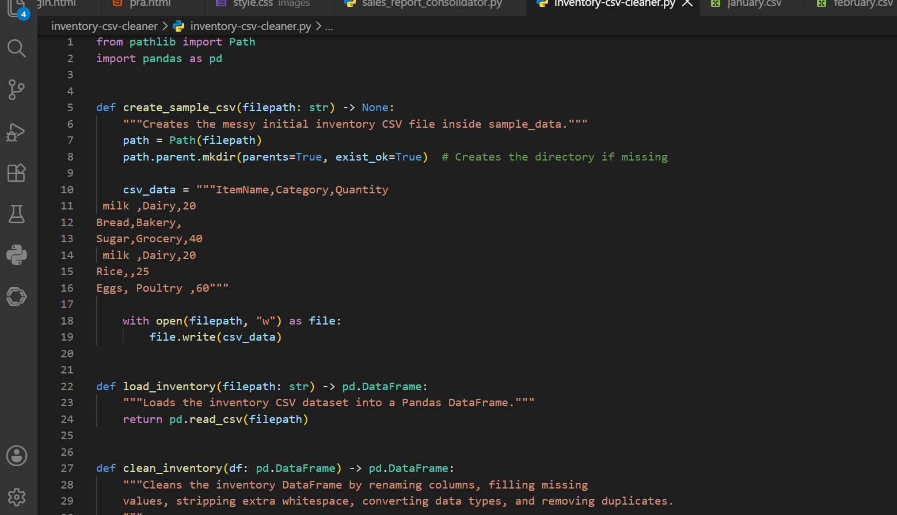
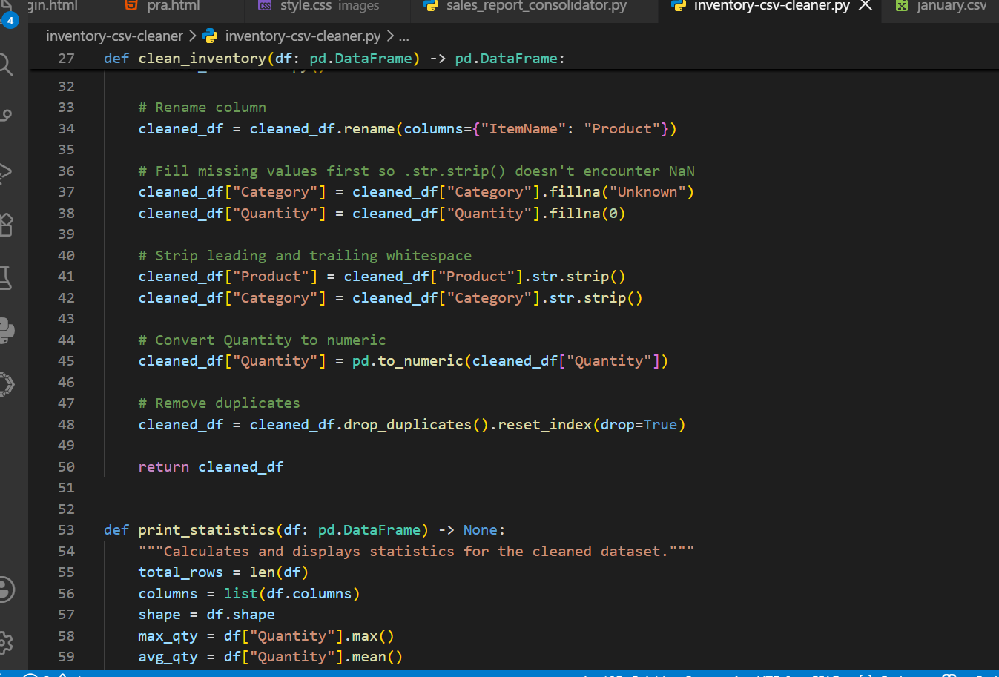
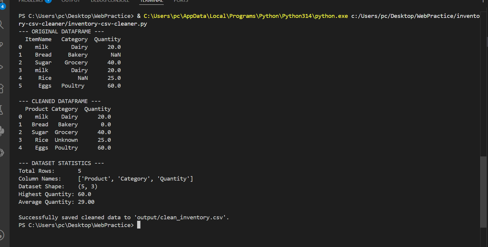

# Inventory CSV Cleaner

A Python automation tool that cleans messy inventory CSV data by standardizing text, handling missing values, converting data types, removing duplicates, calculating statistics, and exporting a clean CSV report.

## What This Project Does

This project automates a common data-cleaning task: preparing messy inventory data for further analysis or reporting.

The script:

1. Creates a sample inventory CSV containing messy data.
2. Loads the CSV using Pandas.
3. Renames columns for consistency.
4. Removes leading and trailing whitespace.
5. Fills missing categories.
6. Fills missing quantities.
7. Converts quantity values to numeric data.
8. Removes duplicate records.
9. Calculates dataset statistics.
10. Exports the cleaned data as a CSV file.

## Technologies Used

* Python
* Pandas
* CSV
* File handling
* Functions

## Project Structure

```text
inventory-csv-cleaner/
│
├── output/
│   └── clean_inventory.csv
│
├── sample_data/
│   └── inventory.csv
│
├── screenshots/
│   ├── 01_code_setup.png
│   ├── 02_processing_reporting.png
│   └── 03_successful_execution.png
│
├── README.md
└── inventory-csv-cleaner.py
```

## Example Input

The project starts with inventory data containing common data-quality problems:

```text
ItemName,Category,Quantity
milk ,Dairy,20
Bread,Bakery,
Sugar,Grocery,40
milk ,Dairy,20
Rice,,25
Eggs, Poultry ,60
```

The dataset contains:

* Leading and trailing whitespace
* Missing categories
* Missing quantities
* Duplicate records
* Numeric values requiring proper data types

## Cleaning Operations

### Column Renaming

The `ItemName` column is renamed to:

```text
Product
```

### Whitespace Removal

Leading and trailing whitespace is removed from product and category names.

For example:

```text
"milk " → "milk"
" Poultry " → "Poultry"
```

### Missing Values

Missing categories are replaced with:

```text
Unknown
```

Missing quantities are replaced with:

```text
0
```

### Data Type Conversion

Quantity values are converted to numeric values using Pandas.

### Duplicate Removal

Duplicate inventory records are removed using `drop_duplicates()`.

## Example Result

After cleaning, the dataset contains:

```text
  Product Category  Quantity
0    milk    Dairy      20.0
1   Bread   Bakery       0.0
2   Sugar  Grocery      40.0
3    Rice  Unknown      25.0
4    Eggs  Poultry      60.0
```

## Dataset Statistics

The cleaned dataset produces:

```text
Total Rows:       5
Column Names:     ['Product', 'Category', 'Quantity']
Dataset Shape:    (5, 3)
Highest Quantity: 60.0
Average Quantity: 29.00
```

## Generated Report

The cleaned dataset is exported to:

```text
output/clean_inventory.csv
```

The resulting CSV can then be used for reporting, analysis, or further automation.

## How to Run

### 1. Clone the repository

```bash
git clone https://github.com/georgesorrowist170-sudo/inventory-csv-cleaner.git
```

### 2. Install Pandas

```bash
pip install pandas
```

### 3. Run the script

```bash
python inventory-csv-cleaner.py
```

The cleaned report will be saved to:

```text
output/clean_inventory.csv
```

## Screenshots

### Code Setup



### Processing and Reporting



### Successful Execution



## Skills Demonstrated

This project demonstrates practical Python automation and data-cleaning skills including:

* Python functions
* File handling
* CSV processing
* Pandas DataFrames
* Data cleaning
* Missing-value handling
* String cleaning
* Data type conversion
* Duplicate removal
* Statistical calculations
* CSV report generation
* Project organization

## Purpose

This project was built as a practical example of automating repetitive inventory data-cleaning tasks with Python and Pandas.

